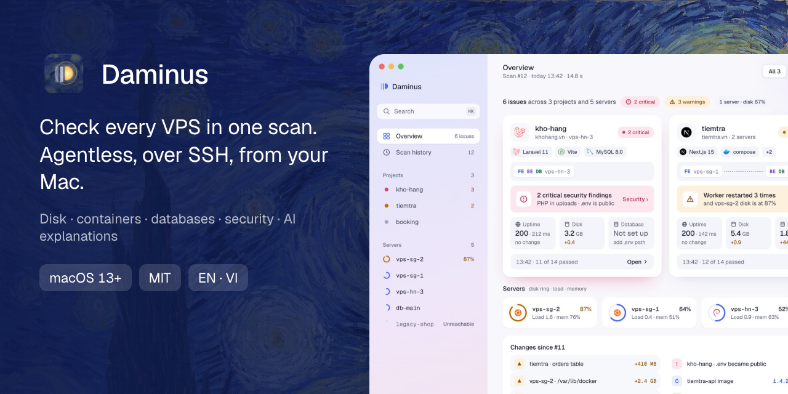
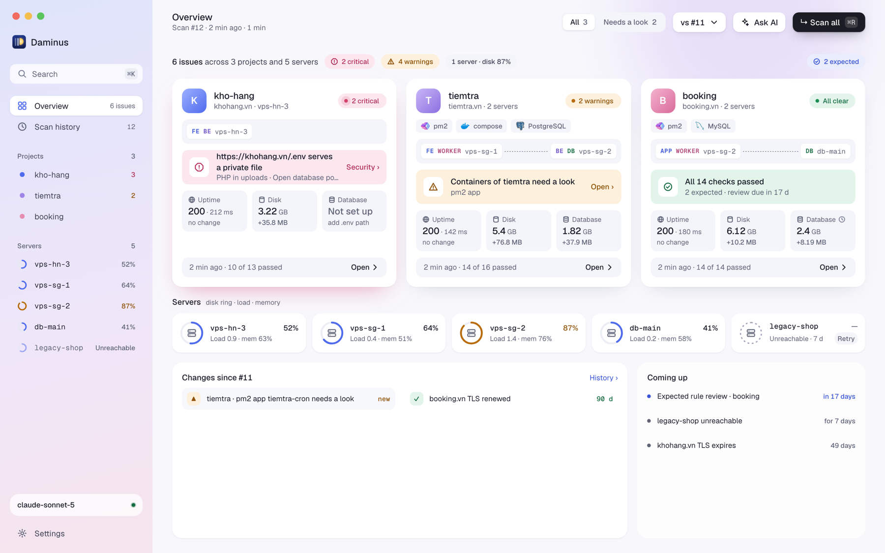
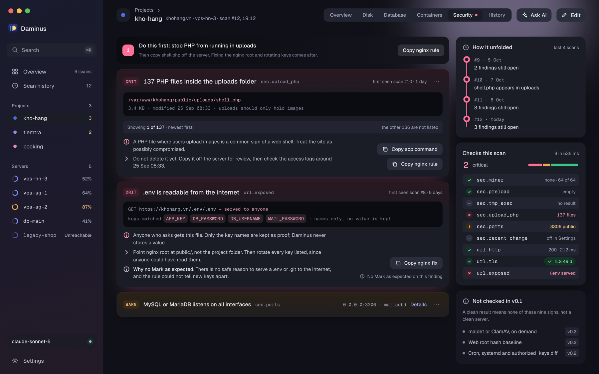

<p align="center">
  
</p>

<h1 align="center">Daminus</h1>

<p align="center">
  <a href="https://github.com/locflamedia/daminus/stargazers"></a>
  <a href="https://github.com/locflamedia/daminus/releases"></a>
  <a href="https://github.com/locflamedia/daminus/releases"></a>
  <a href="LICENSE"></a>
  
  
</p>

<p align="center">
  <strong>Open the app, scan your servers, see what's wrong with each project, close the app.</strong><br>
  Agentless. Read-only. Nothing to install on your servers.
</p>

---

Daminus is a Mac app that checks the servers behind your web projects over plain SSH. It installs nothing on them and only reads. Results are grouped by project (frontend, backend, database, worker) instead of by machine.

> [!NOTE]
> Daminus is close to v0.1.0. Builds are published as pre-releases (`v0.1.0-rc.N`) on the [Releases](https://github.com/locflamedia/daminus/releases) page, starting with the first tag. It has had little testing on real servers so far, so expect rough edges, and please report them.

## Why

I run a few VPSes for a few web projects. Most monitoring tools want an agent on every server and a dashboard that stays up all day, which is too much for that. A few times a week I just want to know whether something is about to break, so Daminus works like this:

- It uses your own `ssh` and `~/.ssh/config`, so ProxyJump, 1Password or Secretive agents and `known_hosts` behave as they do in your terminal.
- Checks only read. Nothing is written to or deleted from the server, and CI fails if a check tries.
- You get one card per project: URL health, TLS expiry, disk, containers and pm2, database size, security signs.
- Nothing runs in the background. A scan is one SSH call per host, and it happens when you press the button.
- AI review is optional and off until you add a key: Anthropic, OpenAI, Gemini, DeepSeek, OpenRouter, a local Ollama, or any OpenAI-compatible endpoint.

## Screenshots

<p align="center">
  
</p>

<p align="center">
  
</p>

<sub>Both use the app's built-in sample data. The theme follows your system; English and Vietnamese are built in.</sub>

## How it works

```
~/.ssh/config ─► Daminus ──ssh <host> 'sh -s' < bundle──► server (POSIX sh, read-only checks)
                    │                                        │
                    │◄──────────── JSON lines ───────────────┘
                    ▼
             project cards + diff vs. last scan ──► (optional) AI summary
```

- Each check is a small POSIX shell script in `crates/core/checks/` that prints facts as JSON. The Rust side decides how serious a fact is from thresholds in a manifest. Adding a check takes a shell script, a manifest entry, two strings and a golden output file, and no Rust (see [CONTRIBUTING.md](CONTRIBUTING.md)).
- Your config is a hand-editable `projects.json` that refers to SSH host aliases. It holds no secrets.
- Database credentials are read from the `.env` file on the server and never leave it.
- AI keys are kept in the macOS Keychain, and secrets are redacted before anything is sent.

## v0.1 features

- [x] Setup: pick hosts from `~/.ssh/config`, auto-discover compose projects, pm2 apps, nginx sites and databases, and group them into projects
- [x] 21 read-only checks:
  - system: load, memory, swap, pressure, OOM kills;
  - disk: filesystems, big folders, big logs, Docker usage;
  - services: compose containers, pm2 apps, database size (MySQL/MariaDB, PostgreSQL);
  - security signs: miner processes, PHP in upload folders, executables in `/tmp`, `ld.so.preload`, public ports, recently changed files;
  - URLs: HTTP status and latency, TLS expiry, an exposed `.env` or `.git`
- [x] Parallel scan with results streaming in per host; a host that does not answer shows as unreachable, never as healthy
- [x] Project cards sorted by severity, with changes since the previous scan and a forecast for filling disks
- [x] History: past scans are kept, and you can mark a finding as expected once you have decided it is fine
- [x] Menu bar icon with the latest result, Scan now, and a shortcut to the project that needs a look
- [x] AI review and Ask (optional): findings and follow-up questions on a redacted payload you can read before it is sent. It only answers in text and never runs commands. A beta provider can use your own signed-in Claude Code
- [x] Keyboard: ⌘K to search, ⌘R to scan, `?` for the shortcuts
- [x] English and Vietnamese, light and dark, Reduce motion respected
- [x] macOS `.dmg` release (published with the first tag; Linux and Windows are best effort)

## Install

Needs macOS 13 or later. Download the `.dmg` for your Mac and drag Daminus to Applications:

- [Apple Silicon (M1 and later)](https://github.com/locflamedia/daminus/releases/download/v0.1.0-rc.1/Daminus_0.1.0-rc.1_aarch64.dmg)
- [Intel](https://github.com/locflamedia/daminus/releases/download/v0.1.0-rc.1/Daminus_0.1.0-rc.1_x64.dmg)

Every build, including older ones, is on the [Releases](https://github.com/locflamedia/daminus/releases) page. There is no Homebrew cask yet: the builds are not notarized, so the `.dmg` is the only way to install for now.

To check the download, run this in the folder that holds the files:

```sh
shasum -a 256 -c SHA256SUMS --ignore-missing
gh attestation verify Daminus_<version>_<arch>.dmg --repo locflamedia/daminus
```

The second command checks the build attestation that CI publishes for each `.dmg`.

### Opening an app that is not notarized

The builds are signed ad hoc and not notarized by Apple, so Gatekeeper blocks the first launch. On macOS 15 (Sequoia) and later:

1. Try to open Daminus once and dismiss the warning.
2. Open System Settings › Privacy & Security, scroll to Security, and click Open Anyway next to Daminus. The button stays for about an hour.

Or remove the quarantine flag in a terminal: `xattr -d com.apple.quarantine /Applications/Daminus.app`.

On macOS 15, right-click › Open no longer gets around Gatekeeper for apps like this (see Apple's [notes on runtime protection](https://developer.apple.com/news/?id=saqachfa)); older versions still allowed it.

Because of the ad hoc signature, every new version looks like a new app to macOS. After an update it asks again before Daminus can read the AI key from your Keychain. Choose Always Allow, or enter the key again in Settings › AI providers.

### The Claude Code provider and the file-access prompt

The Claude Code provider is not a copy of Claude inside Daminus. It runs the `claude` command line tool you already have signed in, as a child process, and passes your question to it.

Because it is a child of Daminus, macOS credits anything it reads to Daminus. So the first time you use this provider, macOS may ask whether Daminus can read files in a folder such as Documents. That prompt is about the `claude` tool, not about Daminus going through your files.

You can click Don't Allow and the answer still works. Daminus gives the tool an empty temporary folder to work in, sends your question on its standard input and reads the reply from its standard output, so none of your files are part of the exchange.

## Limits

- A server an attacker controls can answer anything, because every check runs on the server. "No problems found" is a hint, not proof.
- Alpine and busybox servers are not supported in v0.1. Checks that need GNU or full POSIX tools report as unsupported there.
- Linux and Windows are best effort. They are not released; only macOS builds are.

## Tech stack

[Tauri 2](https://tauri.app) · Vue 3 + TypeScript · Rust · [`genai`](https://github.com/jeremychone/rust-genai) for multi-provider AI

## Contributing

Contributions are welcome, new checks most of all. Read [CONTRIBUTING.md](CONTRIBUTING.md) first. For questions and ideas, use [Discussions](https://github.com/locflamedia/daminus/discussions). Design notes and decisions are in [docs/](docs/).

To report a vulnerability, follow [SECURITY.md](SECURITY.md) and please don't open a public issue.

The Starry Night by Vincent van Gogh (public domain) appears in the icon and the intro; other credits are in [THIRD_PARTY_NOTICES.md](THIRD_PARTY_NOTICES.md).

<a href="https://github.com/locflamedia/daminus/graphs/contributors">
  
</a>

## ⭐ Star History

If Daminus is useful to you, a star helps other people find it.

[](https://star-history.com/#locflamedia/daminus&Date)

## License

[MIT](LICENSE)
